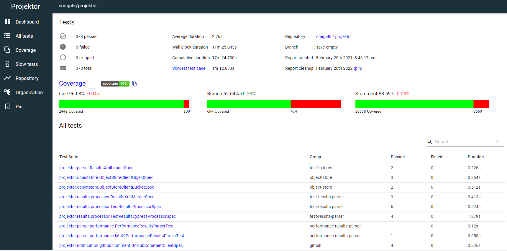
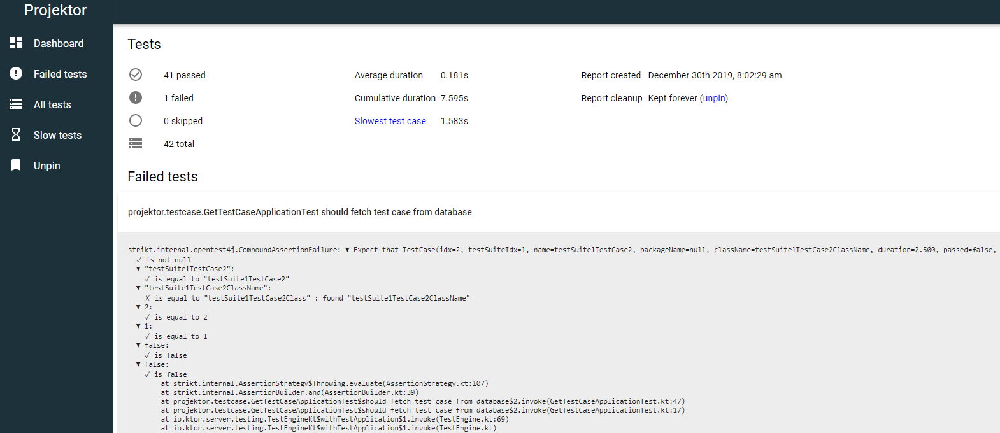
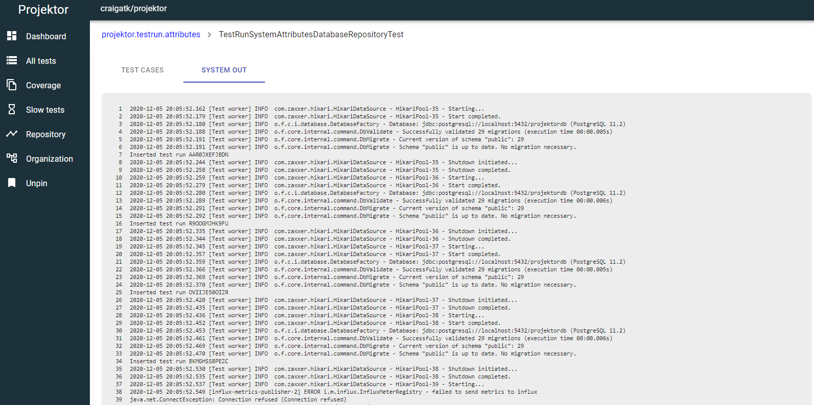
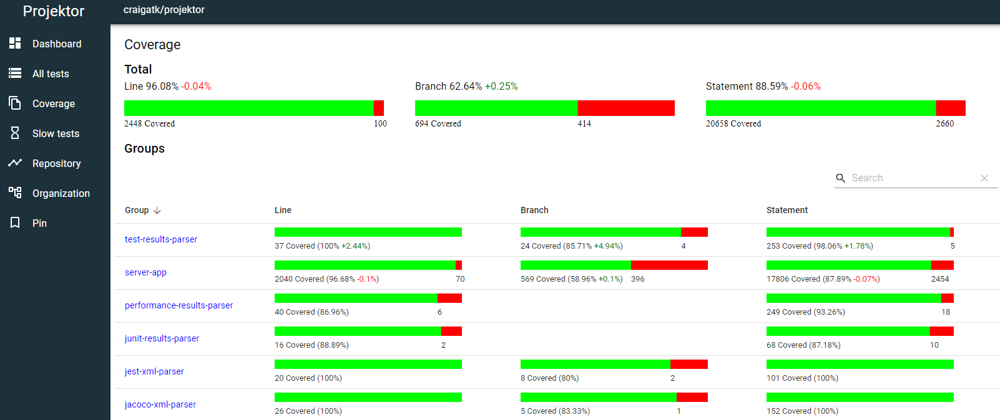
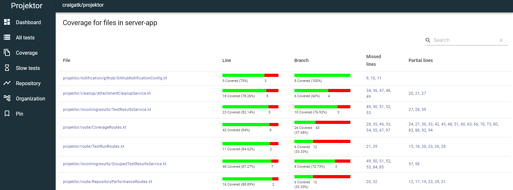
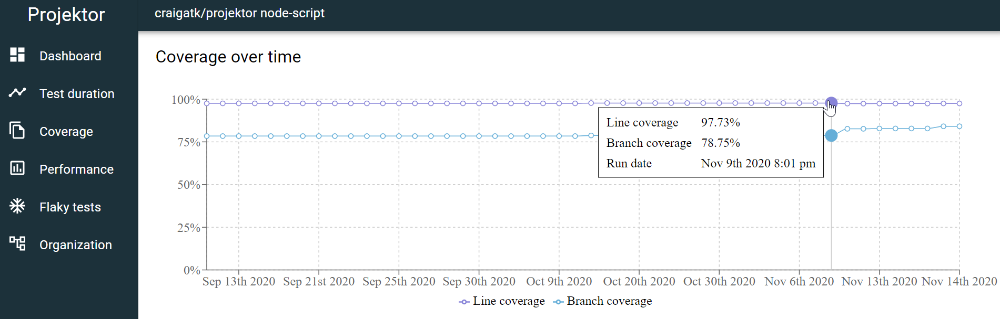
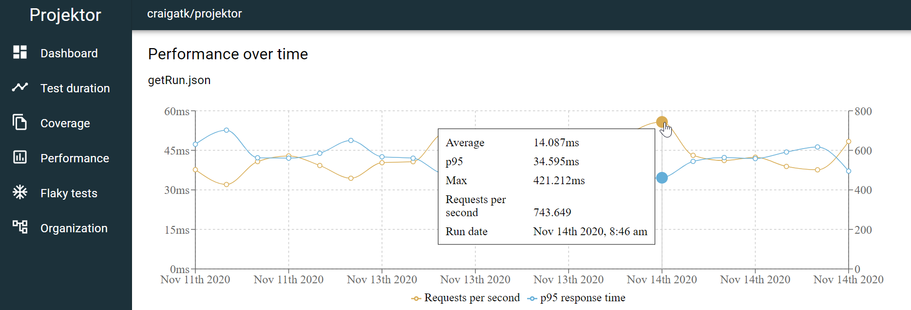
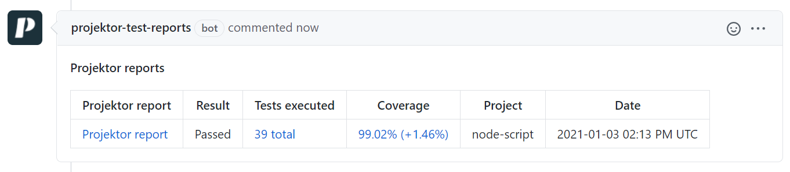

# Projektor

| Project | Coverage |
| ------- | -------- |
| Server |  |
| UI |  |
| Node publisher |  |

For detailed instructions to get started with Projektor, please see the full project documentation at https://projektor.dev

## Test reports

Tests failing on your machine and need help debugging them? Or tests are passing local but failing in CI and
CI doesn't record the test report? Debugging tests in these scenarios can be time consuming and painful,
especially if you don't have the full context of the test failure.

Access and share your full test reports quickly and easily with Projektor.

Projektor shows a summary of all the tests executed as part of your test run:

https://projektorlive.herokuapp.com/tests/TILYIQUYXDUP

The summary includes things like number of tests executed, how many passed or failed, etc.
And if there are any failures, those failure details are shown first on the dashboard:

https://projektorlive.herokuapp.com/tests/RA1FTOGJBNKD

To help debug failures in any environment (especially CI), Projektor gives you access
to the system out and system err from each test:

https://projektorlive.herokuapp.com/tests/V1BMYK93MTNR/suite/65/systemOut

## Code coverage stats

Projektor can capture and visualize code coverage stats from any project that can output code coverage data in 
Jacoco (Gradle, sbt, etc.) or Clover (Jest, etc.) formats.

Projektor calculates overall code coverage stats for the project as well as per-module coverage breakdowns
for Gradle multi-project builds:

Drilling down further, Projektor can show file-level coverage stats, including which lines are covered, partially covered, or fully missed.

For example https://projektorlive.herokuapp.com/tests/TILYIQUYXDUP/coverage/server-app/files

Projektor can also graph your project's code coverage over time, giving you the opportunity to see
how the code coverage is trending:

More details about using code coverage with Projektor are at https://projektor.dev/docs/code-coverage/

## Performance test results

Projektor can record and graph your

More details on performance test results with Projektor are at https://projektor.dev/docs/performance-test/

## GitHub pull request comments

Projektor can comment directly on your pull request with direct links to the test report, code coverage data - 
including the change in coverage percentage in the PR.

Details on how to set this up are at https://projektor.dev/docs/github-pull-request/

## Development

For information on how Projektor is developed, how to build it from source and deploy it yourself, and other
development information, please see [the development guide](DEVELOPMENT.md)

## Contributors

A big thank you to the contributors to this project!

* Aaron Zirbes - [aaronzirbes](https://github.com/aaronzirbes)
* Alex Hatzenbuhler - [ahatzz11](https://github.com/ahatzz11)
* Connor Hasting - [CodedChai](https://github.com/CodedChai)
