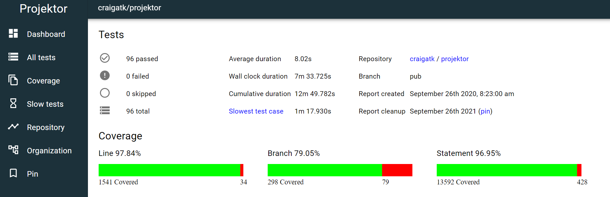

# Projektor

Tests failing on your machine and need help debugging them? Or tests are passing local but failing in CI and
CI doesn't record the test report? Debugging tests in these scenarios can be time consuming and painful,
especially if you don't have the full context of the test failure.

Access and share your full test reports quickly and easily with Projektor.

For full instructions to get started with Projektor, please see the project documentation at
https://projektor.dev/docs/introduction/

## Examples

Projektor shows a summary of all the tests executed as part of your test run:

https://projektorlive.herokuapp.com/tests/PYFUDE19WISR

The summary includes things like number of tests executed, how many passed or failed, etc.
And if there are any failures, those failure details are shown first on the dashboard:

https://projektorlive.herokuapp.com/tests/RA1FTOGJBNKD

To help debug failures in any environment (especially CI), Projektor gives you access
to the system out and system err from each test:

https://projektorlive.herokuapp.com/tests/PYFUDE19WISR/suite/14/systemOut

## Development

For information on how Projektor is developed, how to build it from source and deploy it yourself, and other
development information, please see [the development guide](DEVELOPMENT.md)

## Contributors

A big thank you to the contributors to this project!

* Aaron Zirbes - [aaronzirbes](https://github.com/aaronzirbes)
* Alex Hatzenbuhler - [ahatzz11](https://github.com/ahatzz11)
